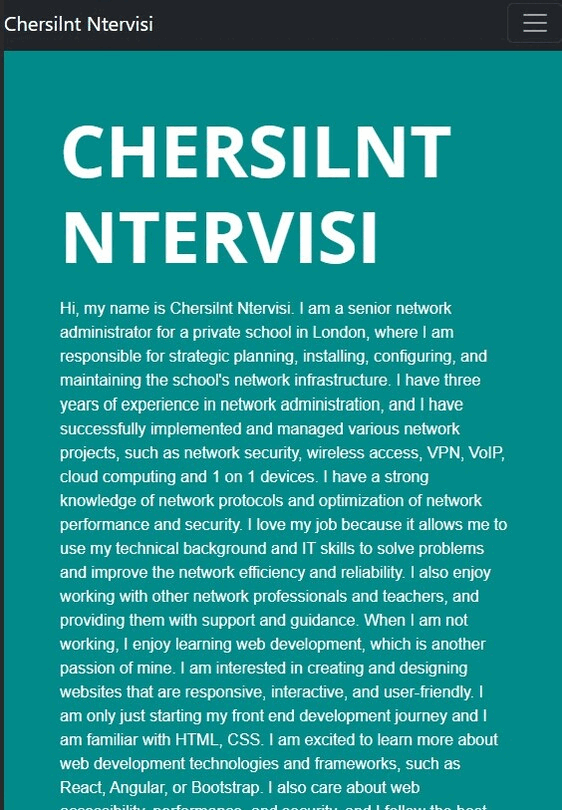

# Bootstrap-Portfolio

## Description
This repository contains a Bootstrap-based portfolio website. The project aims to demonstrate the use of Bootstrap components to create a responsive and visually appealing portfolio.

## Usage
The website consists of four sections: About me, Resume, Work and Contact.
The About me section contains a brief introduction of myself and the work I do. 
The Work section contains a grid of web applications that I have worked on, with titles and images. 
The Resume section contains my CV and recent employment history.
The Contact section contains basic contact details such as my email address and social media.

The user can navigate to different sections by clicking on the links in the navigation menu or by scrolling the web page. The user can also click on the images of the web applications to go to the live demos or the source codes.

The website is responsive and adapts to different screen sizes and devices. The layout and design of the website change according to the width of the viewport. For example, on smaller screens, the grid of web applications becomes a single column instead of two.

You can visit the website by clicking on this [LINK](https://cntervisi.github.io/Bootstrap-Portfolio/).

Here are some GIF's of the website for desktop and mobile viewports:

## Credits/Acknowledgments
Bootstrap for providing the powerful CSS framework.
GitHub and GitHub Pages for hosting the website.
Google Fonts for using their fonts free of charge.

## License
This project is licensed under the MIT License. See the [LICENSE](./LICENSE) file for more details.